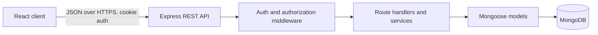

# Daymark Study Planner: MERN Architecture

## 1. Product Scope

Daymark is a responsive study planner for students. The first release supports account registration and login, subject organization, dated study tasks, a focus timer, and a weekly progress view. A user can only access their own planner data.

The current root `index.html` is a standalone visual prototype. Keep it as a reference while implementing the MERN application in `client/` and `server/`; do not make the prototype a production dependency.

## 2. Technology

- **Frontend:** React, Vite, JavaScript, React Router, plain CSS or CSS Modules.
- **Backend:** Node.js, Express, JavaScript.
- **Database:** MongoDB with Mongoose.
- **Validation:** Zod on incoming API requests; enforce important constraints again in Mongoose.
- **Authentication:** bcrypt password hashes and signed JWTs in `HttpOnly` cookies. Do not keep auth tokens in `localStorage`.
- **Testing:** Vitest and React Testing Library for client behavior; Node's test runner or Jest/Supertest for API and database-backed integration tests.

Use the current Node.js LTS release. Keep the client and server independently runnable during development.

## 3. High-Level Layout



The browser owns transient interface state and timer ticks. The API is authoritative for users, subjects, tasks, and completed focus sessions. The browser submits a focus session when it finishes; refreshing the page must not silently create a completed session.

## 4. Repository Structure

```text
/
  ARCHITECTURE.md
  CODING_AGENT_PROMPT.md
  index.html                 # existing visual prototype; retain as reference
  package.json               # root scripts for client/server development
  .env.example
  client/
    src/
      app/                    # router, app shell, protected routes
      components/             # shared buttons, fields, dialogs, loading states
      features/
        auth/
        tasks/
        subjects/
        focus/
        insights/
      lib/                    # API client and date utilities
      styles/
  server/
    src/
      app.js                  # Express configuration
      server.js               # process entry point
      config/                 # environment and database setup
      middleware/             # auth, validation, errors, not-found
      models/
      routes/
      controllers/
      services/
      validators/
    tests/
```

Keep business rules out of React components and Express route declarations. Controllers should translate HTTP requests and responses; services should own multi-step domain behavior.

## 5. Data Model

Every user-owned record includes `userId`. Queries and mutations must scope by the authenticated user, not by a client-supplied owner ID.

### User

- `displayName`: required string.
- `email`: required, normalized, unique.
- `passwordHash`: required; never returned from an API.
- `timezone`: IANA timezone string, default `UTC`.
- timestamps.

### Subject

- `userId`: required reference to User.
- `name`: required string, unique per user (case-insensitive comparison).
- `color`: validated hex color with a safe default.
- `weeklyGoalMinutes`: non-negative integer.
- timestamps.

### Task

- `userId`: required reference to User.
- `subjectId`: optional reference to a Subject owned by that user.
- `title`: required, trimmed string with a reasonable maximum length.
- `type`: enum such as `study`, `assignment`, `reading`, `revision`, `practice`.
- `scheduledDate`: required `YYYY-MM-DD` calendar date in the user's timezone. Store as a validated date-only string so a task does not shift days when viewed in another timezone.
- `scheduledTime`: optional `HH:mm` local time.
- `estimateMinutes`: positive integer.
- `status`: `pending` or `completed`.
- `completedAt`: nullable timestamp.
- timestamps.

Add indexes for `{ userId, scheduledDate }` and `{ userId, subjectId }`.

### FocusSession

- `userId`: required reference to User.
- `subjectId`: optional reference to a Subject owned by that user.
- `startedAt`, `endedAt`: timestamps.
- `durationMinutes`: positive integer.
- `completed`: boolean.
- timestamps.

Validate durations on the server and reject a session whose end precedes its start. Analytics are derived from completed sessions and task records; do not maintain duplicate counters in the MVP.

## 6. REST API

All routes use the `/api` prefix and JSON request/response bodies. Return `401` for unauthenticated requests, `403` for authenticated but unauthorized operations, `404` for missing or non-owned records, `400` for invalid input, and `409` for uniqueness conflicts.

| Method | Route | Purpose |
|---|---|---|
| `POST` | `/api/auth/register` | Create account and establish session |
| `POST` | `/api/auth/login` | Authenticate and establish session |
| `POST` | `/api/auth/logout` | Clear session cookie |
| `GET` | `/api/auth/me` | Return current user profile |
| `GET` | `/api/subjects` | List current user's subjects |
| `POST` | `/api/subjects` | Create a subject |
| `PATCH` | `/api/subjects/:id` | Update an owned subject |
| `DELETE` | `/api/subjects/:id` | Delete an owned subject; handle or reject linked tasks consistently |
| `GET` | `/api/tasks?from=YYYY-MM-DD&to=YYYY-MM-DD&subjectId=&status=` | List/filter tasks in a date range |
| `POST` | `/api/tasks` | Create a task |
| `PATCH` | `/api/tasks/:id` | Update fields or mark complete/incomplete |
| `DELETE` | `/api/tasks/:id` | Delete an owned task |
| `POST` | `/api/focus-sessions` | Record a completed focus session |
| `GET` | `/api/analytics/weekly?weekStart=YYYY-MM-DD` | Return daily focus minutes and task completion totals |

Use a consistent success shape such as `{ "data": ... }`. Use a consistent error shape such as `{ "error": { "code": "VALIDATION_ERROR", "message": "...", "fields": {} } }`. Do not expose stack traces, database details, or password hashes in production responses.

## 7. Authentication and Security

- Hash passwords with bcrypt; never store plaintext passwords.
- Set JWT cookies `HttpOnly`, `SameSite=Lax`, and `Secure` in production. Keep the signing secret in environment configuration.
- Restrict credentialed CORS to the configured client origin. Verify origins for state-changing requests; add CSRF protection if deployment topology requires cross-site cookies.
- Apply authentication middleware to all planner and analytics routes.
- Validate request params, query strings, and bodies before database operations. Never accept `userId` from request data.
- Use Helmet, sensible JSON body limits, and rate limits on login and registration.
- Use environment variables for MongoDB URI, JWT secret, client origin, and port. Commit `.env.example`, never `.env`.
- Ensure subject references belong to the active user before linking them to tasks or focus sessions.

## 8. Client Behavior

- Provide `Today`, `Week`, `Subjects`, and `Insights` views, plus register/login screens.
- Protect planner routes; restore the session using `/api/auth/me` on app startup.
- Centralize fetch behavior in a small API client with `credentials: 'include'`, JSON handling, and normalized errors.
- Show explicit loading, empty, validation, and server-error states. Keep forms keyboard accessible and label all inputs.
- Use the existing prototype for visual direction: warm neutral canvas, restrained orange accent, colored subject markers, compact task rows, and responsive navigation. Avoid depending on its inline script or localStorage data model.
- Use date-only values consistently in UI and API. Treat a selected calendar day as a user's local day, not as an arbitrary UTC midnight.
- Focus timer controls (start, pause, resume, reset, duration selection) are client-side. Persist a session only after a successful timer completion, and associate it with a selected subject when applicable.

## 9. Error Handling and Observability

Use one Express error-handling middleware. Log unexpected errors server-side with a request ID; return safe, actionable messages to the client. Handle MongoDB connection failures explicitly and do not report the server as ready before the database connection succeeds. Avoid logging credentials, cookies, or sensitive request bodies.

## 10. Verification and MVP Acceptance

The MVP is ready when:

1. A user can register, log in, reload the app, and log out.
2. A user can create, edit, complete, reopen, filter, and delete their own tasks.
3. Tasks remain on the selected calendar day across timezone formatting and browser reloads.
4. A user can create and update subjects and assign tasks to them.
5. A completed focus timer records one session, and the weekly insights reflect it.
6. Requests cannot read or mutate another user's records by changing an ID.
7. Forms have loading, validation, empty, and error states and work with keyboard navigation.
8. The app is usable at mobile and desktop widths.
9. Automated tests cover validation, ownership authorization, task state changes, and focus-session recording.
10. `README.md` documents prerequisites, environment setup, database setup, seed/demo data if provided, and client/server development commands.

## 11. Suggested Implementation Order

1. Scaffold root scripts, Vite client, Express server, environment validation, and MongoDB connection.
2. Add models, request validation, auth cookies, and auth tests.
3. Implement subjects and task CRUD with ownership tests.
4. Build the responsive client shell, auth flow, Today view, and task forms.
5. Add Week and Subjects views, then the focus timer and weekly insights.
6. Run tests and production builds, verify mobile layout, document setup, and review security-sensitive routes.
